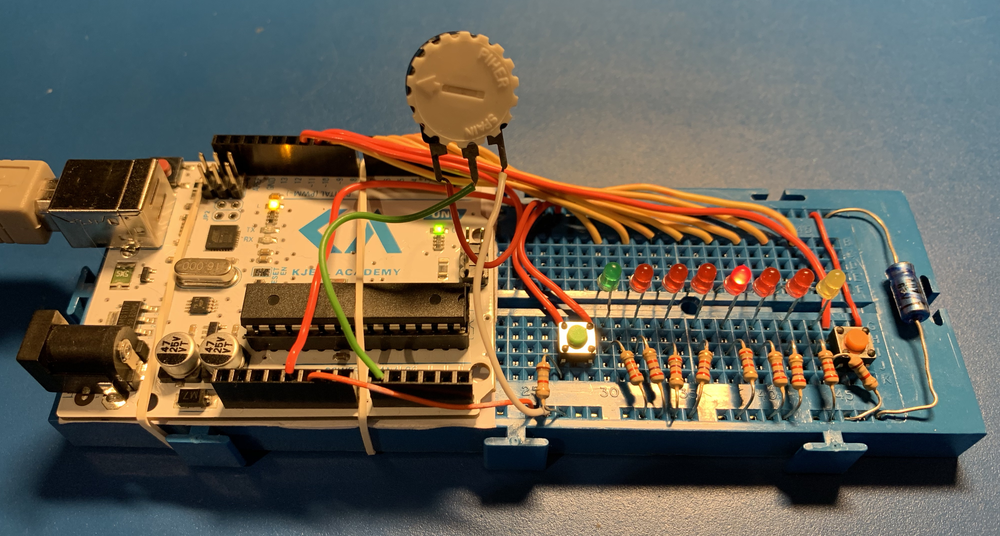

# 1D Pong - an infinitely narrow pong with an infinite number of bounces.

## Rules:
 - Hit your button while your light is lit, if you're too early or to late you loose and the other person wins.
 - The side that lost will serve the ball next round.
## Functions:
 - The lamps on the winning side will light up after a round ends.
 - If you turn the potentiometer the starting speed of the ball will increase.
 - The speed of the ball will increase for every SPEED_INCREASE_INTERVAL´th bounce.
 - If you get over HIGHSCORE_REGISTER_LIMIT number of collective bounces, these are displayed in binary
   format.
 - If you get a score higher than HIGHSCORE_REGISTER_LIMIT and the current highest score, the display
   flashes before the result is showed.

## Installation
The easiest is to open the sketch file (.ino) in Arduino IDE and flash your card from there.

Have fun!
